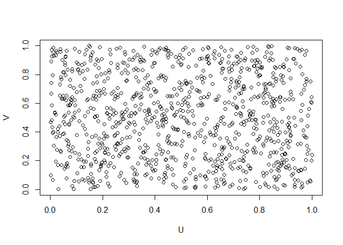

CopulaR (WiP)
================
# Introduction

`CopulaR` is a lightweight vectorised, but non-optimised, copula
framework in R. Copulas are multivariate distribution functions which
have uniform marginals.

## Regular Use

`CopulaR` automatically approximates the density given a copula
function. Conversely, given a copula density it approximates the copula.
We do this through initialisation, namely the `S4` class `Copula` takes
either the density or the copula as an input, i.e. 

``` r
# Initialise with density
Independence = Copula(density = function(u,v){1})

# Initialise with copula
Independence_Alternative = Copula(copula = function(u,v){u*v})
```

The initialisation is rather slow. However, once initialised the
framework is rather fast at sampling and evaluating. In order to
evaluate the density, copula, or sample we use the functions `d`, `p`,
and `r` respectively.

``` r
#Evaluate density 
d(Independence)(0.5,0.5)
```

    ## [1] 1

``` r
#Evaluate copula 
p(Independence)(0.5,0.5)
```

    ## [1] 0.25

``` r
#Sample from the copula (here 1000 points) 
plot(r(Independence)(1000), xlab = "U", ylab = "V")
```



Sampling is *rather* fast, although it can be optimised.

``` r
microbenchmark::microbenchmark(r(Independence)(10000), times = 10)
```

    ## Unit: milliseconds
    ##                    expr      min       lq     mean  median       uq     max
    ##  r(Independence)(10000) 437.8137 461.9183 477.9726 476.672 489.8568 520.069
    ##  neval
    ##     10

Furthermore, a standard plotting method is available. We can specify
whether we want to plot the copula
"),
the density "), the partial derivatives , using the `surface` argument. Standard
surface is ").

``` r
#plot the copula
plot(Independence)
```


``` r
#plot the density
plot(Independence, surface = dC)
```


``` r
#plot dC/dU
plot(Independence, surface = dCdU)
```


``` r
#plot dC/dV
plot(Independence, surface = dCdV)
```


# Methods

We present several methods implemented for the copula object. Recall
that a copula  is
Lipschitz, and thus by Rademacher’s Theorem it is differentiable *almost
everywhere*, i.e. the set of points where
 is not differentiable
has Lebesgue measure .

## The asterisk product

Let \\sim A") and  \\sim B") with  being bi-variate copulas. We define

  
\\cdot\\frac{dB}{dw}(w,v)dw.")  
Then  is a copula, and
the probabilistic interpretation is that
 is the copula of
") given
that ")
are conditionally independent given
. First we initialise
two copulas; a Clayton copula with  and a Gaussian copula with .

``` r
A = Copula(copula = function(u,v){
  theta  = 3

  A = u^(-theta) + v^(-theta) - 1

  (A*(A>0))^(-1/theta)

})


B = Copula(copula = function(u,v){
  apply(X = cbind(qnorm(u),qnorm(v)),MARGIN = 1,FUN =  pmvnorm, lower = -Inf, sigma = cbind(c(1,0.9),c(0.9,1)))
})
```

We then apply the  operation using `%ast%`

``` r
C = A %ast% B

plot(C)
```


Sampling from the new copula is readily
available

``` r
plot(r(C)(1000))
```


## Convex Combinations

The space of copulas is closed under convex combinations. That is, let
"), then B") is a copula where addition for copulas is
defined pointwise in ![(u,v)\\in
\[0,1\]^n](https://latex.codecogs.com/png.latex?%28u%2Cv%29%5Cin%20%5B0%2C1%5D%5En
"(u,v)\\in [0,1]^n").

``` r
D = Convex(A,B,0.5)

plot(D, surface = C)
```


# Approximation Methods and Internals

We briefly discuss how the internals of the package works. The following
is rather loose treatment of the subject.

## Approximation of Copula, Density, and Partial Derivatives

Suppose we initialse the copula `C` using the `copula` argument. The
function is then evaluated on a  mesh
with ") where
 belongs to some
partition of ![\[0,1\]](https://latex.codecogs.com/png.latex?%5B0%2C1%5D
"[0,1]") and  to
some, possibly different, partition of
![\[0,1\]](https://latex.codecogs.com/png.latex?%5B0%2C1%5D "[0,1]").

Since copulas are differentiable almost everywhere, we apply (bi)linear
interpolation between the points on the grid, with the expectation that
the approximation is *reasonable*. This may be subject to change to
better approximations methods. Similarly, the density and partial
derivatives are linearly interpolated.

In term of calculating partial derivates we have implemented the
function `Partial_Derivative` in accordance with the `dplyr` and
`tidyverse` framework; the grid
 is expanded into “long”
format, i.e. a dataframe with each row being a tuple ") for each  and . In order to take a partial derivative we,
say  we
group by  and apply the
standard numerical derivatives; central differencing in the interior and
forwards or backwards differencing on the boundary. The code is provided
below.

``` r
Partial_Derivative = function(.Data, Z, X, ...,  Name){
  if(missing(Name)){Name = paste0("d",as_string(ensym(Z)),"d",as_string(ensym(X))) }else{ Name = as_string(ensym(Name))}
  
  # Identify the Boundary
  
  boundary = .Data %>% pull({{X}}) %>% {c(min(.),max(.))}
  
  # Differencing
  .Data %>%
    group_by_at(vars(...,-{{Z}},-{{X}})) %>%
    arrange({{X}}) %>%
    mutate(!!Name := case_when(
      {{X}} == boundary[1] ~ (lead({{Z}}) - {{Z}})/(lead({{X}})-{{X}}),
      {{X}} == boundary[2] ~ ({{Z}} - lag({{Z}}))/({{X}} - lag({{X}})),
      TRUE ~ (lead({{Z}})- lag({{Z}}))/(lead({{X}})-lag({{X}}))
    )) %>% ungroup()

}
```
